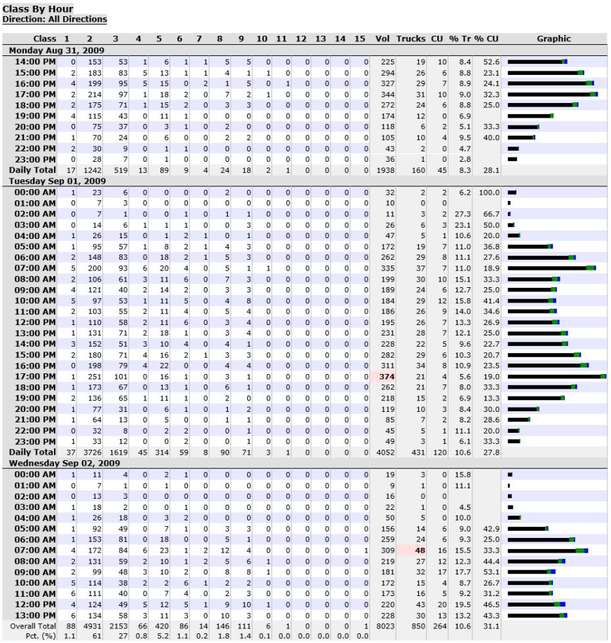
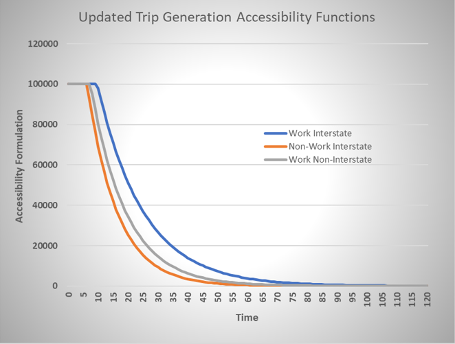
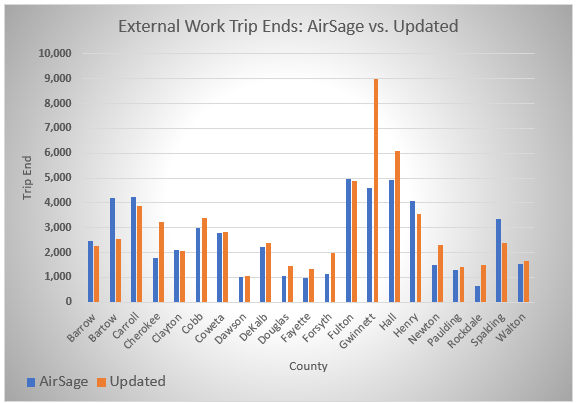
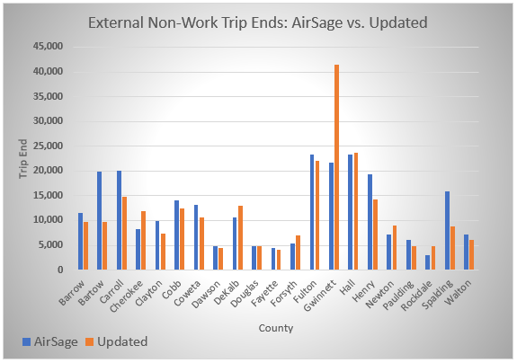
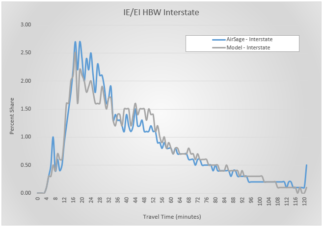
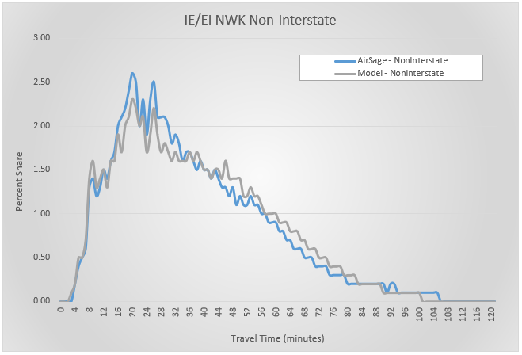

The external model predicts the trips for passenger cars and trucks entering and exiting the ARC model boundary.  The external model has been updated/modified several times; however, it was initially developed based on a road-side survey conducted by ARC in 1994-1995 at 30 sites on the periphery of the then 13-county region.  Based on this data, the following external sub-models were developed:

*	External-external passenger car
*	Internal-external passenger car
  +	Work trips using interstate facilities
  +	Non-work trips using interstate facilities
  +	Work trips using non-interstate facilities
  +	Non-work trips using non-interstate facilities


The external model also includes the splitting of truck trips between medium trucks, heavy trucks, and commercial vehicles.  Given the age of the survey, how the ARC model boundary has expanded, and transitioning to different base years, updates to the external model have occurred over several years.  The modifications have included the following:

*	Commercial vehicle and truck model
*	Use of 2015 average weekday traffic counts
*	Expanded model coverage area / new external stations
*	Use of GDOT vehicle classification counts
*	Comparisons to the GDOT statewide travel model
*	Comparison to AirSage origin-destination flows

# Section 4.1 AirSage Data

To provide insight for travelers that have at least one trip end outside the Atlanta region, ARC contracted with AirSage to purchase origin-destination data for the entire model area and some areas external to the model region. Through the use of pattern recognition algorithms paired with cellular phone data, AirSage can develop origin-destination trip tables for predefined areas of geography.  ARC elected to purchase AirSage data from October 2015 which included information related to trip purpose and time-of-day.  

The AirSage data was provided in comma separated value format and processing the data was required prior to any comparisons to model output.  The main components for processing the data included the following:

1.	District Definitions
2.	External Station Allocation
3.	District to Model Traffic Analysis Zone (TAZ) Disaggregation

Details related to the processing of the AirSage data for calibrating and validating the external model are provided in a separate document ARC 2018 External Model Update. The focus of the subsequent sections is the calibration and validation results of the model in comparison to the traffic counts and the final processed AirSage data.

# Section 4.2 External Station Inputs

The external model includes 109 stations at the boundary numbered from 5923 to 6031.  These stations serve as the connection between the ARC model area and the area outside the boundary.  The origins and destinations outside the model area passing through the external stations are not known or estimated by the model.  Therefore, the origins and destinations are located at the external stations for the purposes of this model.  The external stations were selected generally based on the criteria of more than 500 average vehicles per day and/or provide necessary connectivity to TAZs at the model boundary.  The data input file for the external stations contains several sources of information that are used by the model to estimate vehicle trips.

# Section 4.2.1 Traffic Counts

For the year 2015 base model, the total number of external trips at each station is known based on traffic counts collected by GDOT  that are available for public download.  These traffic counts are a critical component of the external model input and were selected as close to the external station location as possible.  As GDOT counts represent average annual daily traffic (AADT) and the model generates average weekday traffic (AWDT), it was necessary to convert the AADT to AWDT.  This conversion was done by reviewing data from GDOT's permanent count locations and comparing traffic counts between an average weekday and an average week.  The resulting factors applied to the AADTs are approximately 1.003 for interstates and 1.07 for non-interstates.
The external station input file also includes percentage splits for the different vehicle classes at each external station.  GDOT has a comprehensive data collection program that includes vehicle classification counts throughout the modeled area.  Of the external stations at the model boundary, almost 70% have vehicle classification counts available which were used to determine the medium and heavy truck percentages.  For the stations that did not have classification counts available, a review of the GDOT statewide model and roadway type were used to assert the percentages.  An example of the available classification counts from GDOT is shown in Figure 4-1.

The only means to obtain the number of commercial vehicles at a station (non-personal, business oriented trips not involving medium or heavy trucks) is to perform special traffic counts as these vehicles are not captured with typical methodologies.  In 2007, ARC performed special counts at some locations for the purposes of developing a commercial vehicle model component.  It did not include all external stations; therefore, averages by facility types were used to assert those values throughout the region as part of that model update.  As no known additional data is available on these vehicle types, the percentages were not modified.  After including updates to the medium and heavy truck percentages, the passenger car percentages were then computed as 100% - (% commercial vehicle + % medium truck + % heavy truck).

<br/>



# Section 4.2.2 Internal-External vs. External-External

The external input file also includes percentages that further split the trips into internal-external / external-internal (IE/EI) and external-external (EE) trips.  Trips designated in the IE/EI category include one trip end within the ARC model area while EE trips pass through the model area. After the AirSage ODs were processed, the percentages for these trip types were tabulated and used to update the external station inputs for passenger cars.  The comparison is provided in Table 4-1 and Figure 4-2.

Table 4-1. AirSage versus External Model Station Trips

```{r,echo=F,message=F,warning=F,output=F,out.height=700}
library(kableExtra)
extData1 <- read.csv('data/AirSageModelStationTrips.csv',check.names = F)
kable(extData1, format.args = list(big.mark = ",")) %>%
  kable_styling("striped") %>%
  add_header_above(c(" " = 1, "AirSage" = 2, "Model" = 2))
```

<br/>


# Section 4.3 External to External Flows

In addition to the share of EE trips, the AirSage station-to-station (EE) trip table is used directly as an input into the model; however, the model uses the initial matrix as a seed and applies a Fratar process based on the individual station EE trip totals. For the base case, the input and output trip tables should be near identical. As a check on the outputs, the desire lines (Figure 4-3) and a scatter plot (Figure 4-4) were created to illustrate the model generated EE tables do match what is observed for the base year 2015 conditions.

<br/>


<br/>


# Section 4.4 External Trip Generation

The trip generation component of the external model uses the external station data as productions with the attractions estimated at the internal zones.  The attractions are then balanced to match the overall totals at the external stations.  The magnitude of EI/IE trips at the TAZ level is not only highly dependent on the development within the TAZ, but also on the proximity of the TAZ to the external boundary.  For example, if two TAZs have a similar socioeconomic composition (e.g., number of jobs and households) but one TAZ is 5 minutes from an external station and the other TAZ is 60 minutes from the external station, it is probable the closest zone will generate more trips to/from the external station.  

In calculating the initial unbalanced attractions, the external model also applies coefficients for households and total employment within the attraction TAZ.  The external model estimates attractions for the following four passenger car purposes:
1.	Work trips on interstates
2.	Non-work trips on interstates
3.	Work trips on non-interstates
4.	Non-work trips on non-interstates

The final formulation for the estimation of unbalanced attractions for each trip purpose is as follows:


$$
A[1] = min(100000, 188000 \times exp^{(nearIC \times -0.065)}) \times (employment\times2 + households \times 0.5)
$$
$$
A[2] = min(100000, 188000 \times exp^{(nearIF \times -0.100)}) \times (employment\times2 + households \times 0.5)
$$
$$
A[3] = min(100000, 188000 \times exp^{(nearNC \times -0.085)}) \times (employment\times2 + households \times 0.5)
$$
$$
A[4] = min(100000, 188000 \times exp^{(nearNF \times -0.100)}) \times (employment\times2 + households \times 0.5)
$$

where,

*	A[1] = work trips on interstates
*	A[2] = non-work trips on interstates
*	A[3] = work trips on non-interstates
*	A[4] = non-work trips on non-interstates
*	nearIC = congested travel time between TAZ and nearest external interstate station
*	nearNC = congested travel time between TAZ and nearest external non-interstate station
*	nearIF = free-flow travel time between TAZ and nearest external interstate station
*	nearNF = free-flow travel time between TAZ and nearest external non-interstate station

The accessibility functions are plotted in Figure 4-5 (since the non-work trips use the same formula, there is only one non-work function illustrated). After implementing the new functions, the county level trip ends were summarized by purpose as shown in Table 4-2 and Figures 4-6 and 4-7. Generally, the model is replicating work and non-work external trip ends by county well.  However, the model is overestimating external trips to Gwinnett County. Of the core five counties, Gwinnett is located more closely to a number of external stations and includes a substantial amount of employment. These two are likely contributing to the overestimation and is an area for potential improvement in future model updates.

<br/>



<br/>

Table 4-2. AirSage versus Model Trip Ends by County

```{r,echo=F,message=F,out.height=700}
extData2 <- read.csv('data/AirSageModelTripEnds.csv',check.names = F)
kable(extData2, format.args = list(big.mark = ",")) %>%
  kable_styling("striped") %>%
  add_header_above(c(" " = 1, "AirSage" = 2, "Model" = 2, "Difference" = 2))
```

<br/>



<br/>




# Section 4.5 External Trip Distribution

The external trip distribution model employs a gravity model formulation through the use of friction factors. To calibrate the distribution model, the friction factors were iteratively adjusted until the model was accurately replicating both the average observed trip length and the general shape of the observed trip-length frequency distribution (TLFD) curves. The results after calibration are provided in Table 4-3.

Table 4-3 AirSage versus Model Average Trip Lengths (minutes)

```{r,echo=F,,out.height=700,message=F,warning=F,output=F}
library(tidyverse)
library(knitr)
library(DT)
extData3 <- read_csv('data/AirSageModelTripLengths.csv')
```
```{r,echo=F,message=F,out.height=700}
kable(extData3) %>%
  kable_styling("striped",row_label_position = 'r')
```

<br/>



<br/>


<br/>


<br/>



<br/>

# Section 4.6 External Time of Day


As the AirSage data was provided in ARC's predefined time periods, it was also used to determine the time-of-day shares to convert the daily estimates in the time periods used in the highway assignments.  The final time-of-day shares are provided in Table 4-4 and a comparison of the base year model output to AirSage in Table 4-5.

Table 4-4. External Model Time-of-Day Shares

```{r,echo=F,message=F,warning=F,output=F,out.height=700}
library(kableExtra)
extData4 <- read.csv('data/ExternalModelTODShares.csv',check.names = F)
kable(extData4) %>%
  kable_styling("striped") %>%
  add_header_above(c(" " = 1, "IE Work" = 2, "IE Non-Work" = 2, "EE" = 2))
```

Table 4-5 AirSage versus Model Time of Day Shares
```{r,echo=F,,out.height=700,message=F,warning=F,output=F}
extData5 <- read_csv('data/AirSageModelTOD.csv')
```
```{r,echo=F,message=F,out.height=700}
kable(extData5) %>%
  kable_styling("striped",row_label_position = 'r')
```


# Section 4.7 External Trip Future Forecasts

For the base year 2015 model, the external trips are controlled by the traffic counts at each external station.  For future years beyond 2015, the external trips are forecasted using growth factors and applying those to the 2015 traffic counts.  The growth factors are computed from two primary sources of data:

*	Internal population and employment growth within 45 minutes of the external station
*	External county population growth

The idea behind the growth factor calculation is that the external volume growth is likely to follow a similar pattern as the nearby population and employment growth.  For the internal population and employment growth, the model accumulates the year 2015 (base) and future year scenario population and employment for all TAZs within 45 minutes of each individual external station.  The base and future values for each external station are logged for inclusion in the growth factor.  An example travel shed for the I-75 north external station is provided in Figure 4-12.  

For the external counties, the population forecasts for counties in Georgia are estimated by the Georgia's Office of Planning and Budget and the forecasts for Alabama are provided by the University of Alabama's Center for Business and Economic Research.  The external counties are grouped together into seven larger areas that are expected to influence certain external stations.  In Figure 4-13, the external counties are color-coded by the grouping.  The external station input file also includes this grouping to form the linkage between the two.  

The formula for computing the initial forecast at each station is as follows:

     _forecast1=awdt2015*((futrpe*_coef1 + futrpop*_coef2)/(basepe + basepop))

where,

* _forecast1 = initial future year external station forecast
* awdt2015 = external station 2015 average weekday traffic
* coef1 = factor for internal zones population and employment (currently = 1.0)
* coef2 = factor for external counties population (currently = 1.0)
* futrpe = future year internal population and employment within 45 minutes of external station
* futrpop = future year external county population associated with that external station
* basepe = base year internal population and employment within 45 minutes of external station
* basepop = base year external county population associated with that external station

The final step in the external station forecast includes a planning level check on daily capacity using the number of lanes and whether the facility is an interstate.  This check is included because the external growth in demand needs some connection to the available capacity at the external station.  The daily lane capacities used in this final step are shown in Table 4-6.  In application, the model uses the minimum of the external forecast volumes and the available capacity.  These capacities were generally derived from the Florida DOT's Generalized Annual Average Daily Volume level of service tables; however, the capacities used in ARC's model are higher than those used by Florida DOT.

Table 4-6 External Station Daily Lane Capacity
```{r,echo=F,,out.height=700,message=F,warning=F,output=F}
extData6 <- read_csv('data/ExternalStationCapacity.csv')
```
```{r,echo=F,message=F,out.height=700}
kable(extData6, format.args = list(big.mark = ",")) %>%
  kable_styling("striped",row_label_position = 'r')
```

<br/>


<br/>


