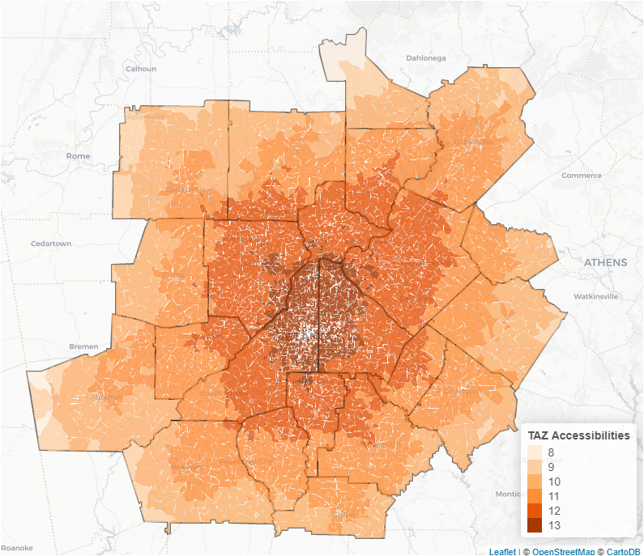

The following sub-sections include descriptions of the long term choice models including:

* Work from Home Choice
* Mandatory Activity Location Choice
* Car Ownership Model
* Free Parking Eligibility

# Section 3.1 Work from Home Choice

Number of Models: 	1 (Work, K-12, University)

Decision-Making Unit:  	Workers

Model Form: 		Multinomial (Binary) Logit

Alternatives:  		2 (Work-From-Home, Out-Of-Home)

The work-from-home model predicts whether a worker works from home or has an out-of-home work location. The survey respondents were asked about their work address with the options of fixed (non-home), home, or variable. The respondents who chose "home" were considered as the work-from-home workers. This model is applied for every employed person in the synthetic population. In the work location model output the work-from-home workers will have a WorkLocation field populated with a value of 9999. The explanatory variables included in the work-from-home model includes person level and household level demographic variables and auto and transit accessibility variables.

# Section 3.2 Mandatory Activity Location Choice

Number of Models: 	3 (Work, K-12, University)

Decision-Making Unit:  	Workers for Work Location Choice

Students under age 16   for Grade School

Students who are Person Type Driving age student for High School

University students for University Model

Model Form: 		Multinomial Logit

Alternatives:  		Traffic Analysis Zones

The workplace location choice model assigns a workplace TAZ for every employed person in the synthetic population who has an out-of-home work location.  Every worker is assigned a regular work location TAZ according to a multinomial logit destination choice model.  The model parameters were estimated using the 2011 HTS; they are given in Appendix B.  The following explanatory variables were found to be significant and are included in the final model specification:

*	Mode choice logsum, which can be understood as a generalized cost of travel averaged over multiple modes
*	Distance
* Distance interactions
    +	Household income
    +	Work status (full vs. part-time)
    +	Area type  
*	Retail accessibility at the workplace location
*	CBD and High density urban area types
*	Size term

The size terms vary according to worker occupations, to reflect the different types of jobs that are likely to attract different (white collar versus blue-collar) workers.  Accessibility is measured by a 'representative' mode choice logsum based on peak period travel (A.M. departure and P.M. return), as well as distance to the workplace.  The mode choice logsum represents the total ease of travel between two zones across all available modes.

Since mode choice logsums are required for each destination, a two-stage procedure is used for all destination choice models in CT-RAMP to reduce computational time (it would be computationally prohibitive to compute a mode choice logsum for each of 5,922 zones and every worker in the synthetic population).  In the first stage, a simplified destination choice model is applied in which all zones are alternatives.  The only variables in this model are the size term and distance.  This model creates a probability distribution for all possible alternatives (zones with no employment are not sampled).  A set of alternatives are sampled from the probability distribution and these alternatives constitute the choice set in the full destination choice model.  Mode choice logsums are computed for these alternatives and the destination choice model is applied.  A workplace TAZ is chosen for each worker from this more limited set of alternatives.  In the case of the work location choice model, a set of 30 alternatives is sampled. Figure 3-1 illustrates the zonal total accessibilities used in the model.

The application procedure utilizes an iterative shadow pricing mechanism in order to match workers to input employment totals by TAZ.  The shadow prices are written to a file and can be used in subsequent model runs to cut down computational time.  The destination-based accessibility type and area type variables are not included in the model in application, since they get replaced by the shadow prices.
The grade school location choice model assigns a school location to every student (student defined based on school attendance obtained from PopSyn output - which is based on PUMS data) who are classified as either Person Type *Non-driving student* or *Pre-school child* .  The size term in this model is school enrollment for elementary and middle school.  The high school location choice model assigns a school location choice to every student who are driving age but are not yet in college (Person Type = Driving age student). The size term for this model is the school enrollment in high school.

The grade school location choice model parameters are given in Appendix B.  The grade school location choice model parameters include person/household characteristics, representative school mode choice logsums, distance, and size terms.  School activities are located at the zone level, through explicitly choosing zones as alternatives in the destination choice model.  

The university location choice model assigns a university location for every university student in the synthetic population.  The size term in this model is university enrollment.   The university location choice model parameters are given in Appendix B.  The university location choice model parameters include person/household characteristics, representative university mode choice logsums, distance, and size terms.  University activities are located at the zone level. 

# Section 3.3 Car Ownership Model

Number of Models: 	1

Decision-Making Unit:  	Households 

Model Form: 		Nested Logit

Alternatives:  		0, 1, 2, and 3+ autos

The car ownership model predicts the number of vehicles owned by each household.  It is formulated as a nested logit choice model with four elemental alternatives, including "no cars", "one car", "two cars",  and "three or more cars".  The model includes the following explanatory variables: 

*	Household size and composition
*	Number of drivers in the household
*	Household Income
*	Auto accessibility
*	Transit accessibility
*	Accessibility via rail for workers and students
*	Auto dependency for workers

Auto and transit accessibilities take the form of destination choice logsum variables.  These variables represent the total ease of travel from the residence zone to all possible destinations, respectively using auto modes and transit modes.  This type of accessibility measure is preferred over measures based solely on travel time or distance because they incorporate multiple indicators of level of service, including cost, and are consistent with modal preferences.

Worker auto dependency is a measure of auto accessibility relative to transit accessibility, specifically for the workplace destinations of workers in the household.  It is computed as the sum, across all workers in the household, of the difference between auto and transit mode choice logsums.  Increasing values indicate worsening transit accessibility (in relative terms) and therefore higher likelihood of owning multiple cars.

Accessibility via rail for workers and students is the ratio of premium transit in-vehicle time to total transit in-vehicle time between home and work (or school, in case of students).  Households that have good access to rail transit are more likely to choose to be transit dependent and forego high levels of auto ownership. 
The auto ownership model parameters were estimated using the ARC 2011 HTS; they are given in Appendix B. 

# Section 3.4 Free Parking Eligibility

Number of Models:	1

Decision-Making Unit:	Persons

Model Form:		Multinomial Logit

Alternatives:		2 (free on-site parking, pay parking)

This model predicts whether drivers traveling to areas where parking is not free have access to free parking.  Respondents were asked about parking costs at their primary tour destination.  The model assumes that people who park for free in downtown are aware of the availability of this free space before they begin any travel tours.  This is likely to be the case for workers who are guaranteed free parking downtown by their employer, but less true for drivers undertaking non-mandatory tours.  The parking eligibility model is placed upstream of the destination and mode choice models so that these choices can be informed by the availability of free parking. Due to its placement in the model stream, the parking eligibility model is largely dependent on household characteristics.  The model parameters are given in Appendix B.