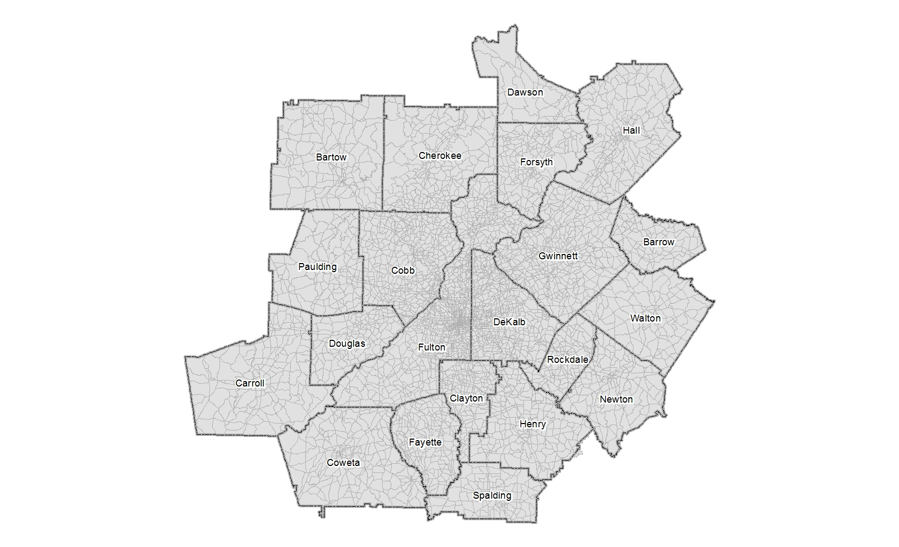
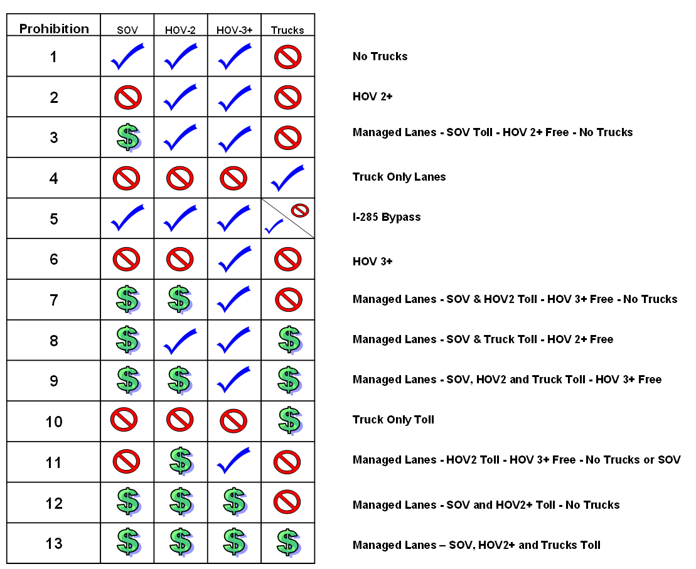
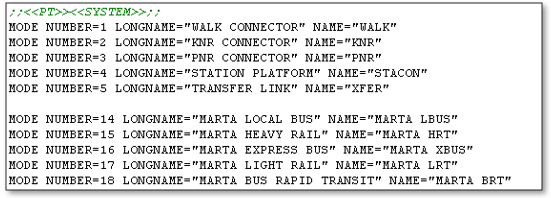
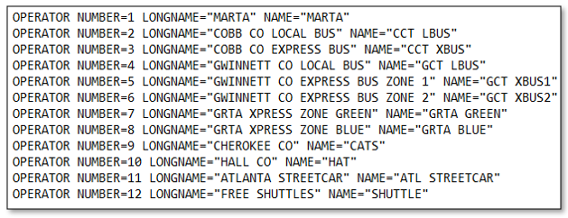
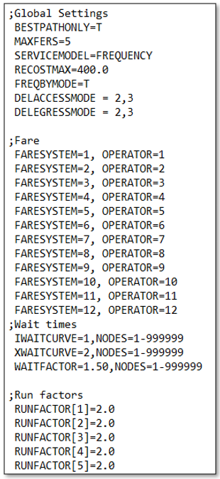
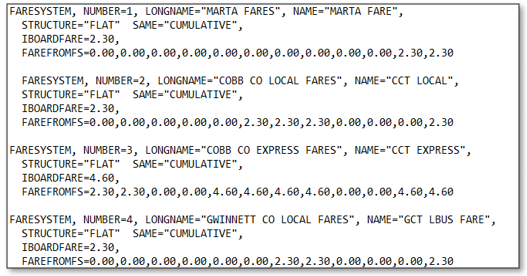

Inputs to the ARC ABM are stored in the following folders: INPUTS, PARAMETERS, WarmStart, and ctrampModels.  The INPUTS and PARAMETERS folders are required for the model to function and contain a number of files.  The WarmStart is only required if the warm start option is selected; however, it is the recommended approach to ensure more efficient model closure within the feedback loop routine. The model script must be run from within the root folder as the paths are relative.  The INPUTS folder contains files that typically vary by model scenario while the PARAMETERS folder contains files that should not be changed. The ctrampModels folder stores all CT-RAMP Utility Expression Calculator (UEC) files and choice model alternatives files.

# Section 6.1 Input Files

Within each of the required folders, there are expected files that are read by the model script.  Any file missing from these folders will cause the model to fail in application.  Table 6-1 includes the names and description of files required in the INPUTS folder.  Some, if not all, of these files will vary between model scenarios.  However, the file naming structure must remain the same.  Table 6-2 provides the list of files required in the PARAMETERS folder.  Except under special circumstances (e.g. splitting zones), these files should not be altered.

**Table 6-1 INPUTS Folder Required Files**    

```{r,echo=F,message=F,warning=F,output=F,out.height=700}
library(tidyverse)
library(knitr)
library(DT)
library(kableExtra)
library(readxl)

T61<- read_excel('data/UserGuideTables.xlsx','T61','B3:C12')
T61[is.na(T61)] <- ''

kable(T61, format.args = list(big.mark = ",")) %>%
  kable_styling("striped")

```

**Table 6-2 PARAMETERS Folder Required Files**    

```{r,echo=F,message=F,warning=F,output=F,out.height=700}

T62<- read_excel('data/UserGuideTables.xlsx','T62','B3:C31')
T62[is.na(T62)] <- ''

kable(T62, format.args = list(big.mark = ",")) %>%
  kable_styling("striped")

```


# Section 6.2 Traffic Analysis Zones

The model area was expanded to include Dalton County which resulted in more internal TAZs. There are now 5,922 internal zones within the ARC boundary.  The zones were built from Census 2010 block geographies and are nested within Census tracts.  Table 6-3 provides the zone numbering by county and a graphic of the zone boundaries is illustrated by Figure 6-1.

**Table 6-3 Zone Ranges by County**    

```{r,echo=F,message=F,warning=F,output=F,out.height=700}

T63<- read_excel('data/UserGuideTables.xlsx','T63','B3:D24')
T63[is.na(T63)] <- ''

kable(T63) %>%
  kable_styling("striped")

```




# Section 6.3 Highway Networks

This section details the attributes in the highway networks, speeds, capacities and how to treat reversible lanes and toll facilities.

## Section 6.3.1 Network Attributes

The network attributes necessary for the model to function properly are provided in Table 6-4.  These attributes include items such as the number of lanes, facility type, distance, etc.  The attributes in Table 18 are also recommended when coding networks to facilitate summarizing the output networks.  Special attention should be given to the traffic count locations especially when copying/pasting link attributes or splitting existing links as it could result in traffic counts in incorrect locations.

**Table 6-4 Highway Network Attributes**    

```{r,echo=F,message=F,warning=F,output=F,out.height=700}

T64<- read_excel('data/UserGuideTables.xlsx','T64','B3:C55')
T64[is.na(T64)] <- ''

kable(T64) %>%
  kable_styling("striped")

```

**Table 6-5 Recommended Highway Network Attributes**    

```{r,echo=F,message=F,warning=F,output=F,out.height=700}

T65<- read_excel('data/UserGuideTables.xlsx','T65','B3:C55')
T65[is.na(T65)] <- ''

kable(T65) %>%
  kable_styling("striped")

```


## Section 6.3.2 Capacities

In previous model versions, the lookups for link capacities were embedded in the model script.  In this newer version, the lookup has been transferred to a DBF structure which is called within the code.  The table is called CAPACITY.DBF and is located in the PARAMETERS folder.  Table 6-6 shows the hourly capacities by facility type and area type.  Similarly, the capacity for the auxiliary lanes is called AUXLANE.DBF (Table 6-7) and is also located in the PARAMETERS folder.


**Table 6-6 Hourly Capacities**    

```{r,echo=F,message=F,warning=F,output=F,out.height=700}

T66<- read_excel('data/UserGuideTables.xlsx','T66','B3:J18')
T66[is.na(T66)] <- ''

kable(T66) %>%
  kable_styling("striped")

```

*Note: ATYPE1-CBD; ATYPE2-Urban Commercial; ATYPE3-Urban Residential; ATYPE4-Suburban Commercial; ATYPE5-Suburban Residential; ATYPE6-Exurban; ATYPE7-Rural*

**Table 6-7 Auxiliary Lane Capacities**    

```{r,echo=F,message=F,warning=F,output=F,out.height=700}

T67<- read_excel('data/UserGuideTables.xlsx','T67','B3:D18')
T67[is.na(T67)] <- ''

kable(T67) %>%
  kable_styling("striped")

```


## Section 6.3.3 Speeds

Similar to the capacities, link speeds were also previously embedded in the model script.  These have also been converted to a DBF structure residing in the PARAMETERS folder.  Table 6-8 provides the free-flow speeds by facility type and area type while Table 6-9 depicts the AM congested speeds for the first feedback loop.

**Table 6-8 Free-Flow Speeds**    

```{r,echo=F,message=F,warning=F,output=F,out.height=700}

T68<- read_excel('data/UserGuideTables.xlsx','T68','B3:J22')
T68[is.na(T68)] <- ''

kable(T68) %>%
  kable_styling("striped")

```

*Note: ATYPE1-CBD; ATYPE2-Urban Commercial; ATYPE3-Urban Residential; ATYPE4-Suburban Commercial; ATYPE5-Suburban Residential; ATYPE6-Exurban; ATYPE7-Rural*


**Table 6-9 AM Congested Speeds - First Feedback Loop**    

```{r,echo=F,message=F,warning=F,output=F,out.height=700}

T69<- read_excel('data/UserGuideTables.xlsx','T69','B3:J22')
T69[is.na(T69)] <- ''

kable(T69) %>%
  kable_styling("striped")

```
*Note: ATYPE1-CBD; ATYPE2-Urban Commercial; ATYPE3-Urban Residential; ATYPE4-Suburban Commercial; ATYPE5-Suburban Residential; ATYPE6-Exurban; ATYPE7-Rural*


## Section 6.3.4 Lane Coding

When coding the number of lanes, there are certain guidelines to follow for auxiliary lanes and when the facility may operate with a different number of lanes by time period.  The LANES field should include auxiliary lanes.  There are several attributes in the network that allow for varying the number of lanes by time period:

* LANESEA: available lanes during early AM period (3:00 AM to 6:00 AM)
*	LANESAM: available lanes during AM Period (6:00 AM to 10:00 AM)
*	LANESMD: available lanes during midday Period (10:00 AM to 3:00 PM)
*	LANESPM: available lanes during PM Period (3:00 PM to 7:00 PM)
*	LANESEV: available lanes during evening/late night Period (7:00 PM to 3:00 AM)

If the lanes do not vary by time period, the LANES attribute should be the only lanes attribute coded (i.e. the period lanes should all be set to zero).  However, if the lanes do vary by period, then the appropriate values should be entered by time period.  The code is written such that if the period lanes are zero, the program defaults to LANES when computing capacity.  If the period lanes are greater than zero, the program uses the period lanes to compute capacity.  Some examples are provided below in Table 6-10 through Table 6-12.  In example 1, four lanes (two lanes each direction) are available throughout the day which requires only LANES to be coded.  The period lanes are left as zero.

**Table 6-10 Time of Day Lanes Example 1**    

```{r,echo=F,message=F,warning=F,output=F,out.height=700}

T610<- read_excel('data/UserGuideTables.xlsx','T610','B3:D9')
T610[is.na(T610)] <- ''

kable(T610) %>%
  kable_styling("striped")

```

Example 2 shows how one type of reversible lane could be handled.  An additional lane is coded in the AB direction for the AM period; however, the BA direction for AM lanes is set to zero.  For the AM period, this facility would operate as 3 lanes in the AB direction and 2 lanes in the BA direction (because LANES = 2).  The reverse is true in the PM period (BA direction = 3 lanes, AB direction = 2 lanes).  With no values coded in the EA, MD, and EV periods, the lanes would default to 2 lanes in each direction.

**Table 6-11 Time of Day Lanes Example 2**    

```{r,echo=F,message=F,warning=F,output=F,out.height=700}

T611<- read_excel('data/UserGuideTables.xlsx','T611','B3:D9')
T611[is.na(T611)] <- ''

kable(T611) %>%
  kable_styling("striped")

```

Example 3 shows a case where a one-way facility has lanes that are only available in the EA and AM period.  In this example, only the LANES EA and LANESAM should have values.  All other lane attributes should be coded as 0 (including LANES).

**Table 6-12 Time of Day Lanes Example 3**    

```{r,echo=F,message=F,warning=F,output=F,out.height=700}

T612<- read_excel('data/UserGuideTables.xlsx','T612','B3:C9')
T612[is.na(T612)] <- ''

kable(T612) %>%
  kable_styling("striped")

```


## Section 6.3.5 Toll Facilities

The coding of toll facilities has not changed in the new model version.  The user must code the TOLLID attribute on the appropriate links to represent a toll facility.  The value on this attribute is at the user's discretion; however, it is recommended that the user follow a defined set of guidelines when coding.  One method is to make the first digit of the toll identifier unique to the corridor it represents and the second digit a directional flag.  An example is provided below in Figure 6-2.  Discussed later in this document is the process of optimizing tolls for managed lane facilities.  To optimize tolls, a comparison between the travel times of the general-purpose lanes and managed lanes is necessary.  To accommodate this, a link attribute called GPID can be used to inform the toll optimization algorithm of the level-of-service characteristics of the competing lanes.  The GPID should be coded with the same number as the competing managed lane facility (i.e. TOLLID = 11 and GPID = 11 for a competing route).  Further information is provided in the highway network coding portion of this document.


The toll rates are defined by the file TOLLS{year}.DBF residing in the INPUTS folder.  The {year} should be representative of the last two digits of the model run year.  Within the file, there should be six column attributes labeled as follows:

*	TOLLID: identifier used to provide the linkage to the highway network
*	TOLLEA: toll rate for early AM
*	TOLLAM: toll rate for AM period
*	TOLLMD: toll rate for midday period
*	TOLLPM: toll rate for PM period
*	TOLLNT: toll rate for evening/late night period
*	FIXED: flag which informs the model if the toll is fixed or distance based

The TOLLID in the database should correspond to the toll identifier coded in the highway network.  Within the model this identifier is used as a lookup value to determine the toll rates to be assessed on the highway links.  The toll rate should be entered in cents (e.g. one dollar is 100) and applied to the appropriate time period.  If the toll rate is unchanged throughout the day, each period should have the same value.  

The FIXED attribute is a simple Boolean logic applying a '1' or '0' which informs the program how to treat the toll ('1' is true and '0' is false).  If the toll rate is fixed, the value should be set to '1'.  If the toll rate is a distance based toll, the FIXED attribute should be set to '0' which tells the program to compute the toll based on the rate and link distance.  The entered toll values should be reflective of the rates applied per mile for each time period.  An example toll file setup is provided below in Table 6-13.

**Table 6-13 Toll ID Database**    

```{r,echo=F,message=F,warning=F,output=F,out.height=700}

T613<- read_excel('data/UserGuideTables.xlsx','T613','B3:H7')
T613[is.na(T613)] <- ''

kable(T613) %>%
  kable_styling("striped")

```


## Section 6.3.6 Prohibitions

The ARC model includes the ability to test various lane restrictions (e.g. HOT lanes, truck lanes, etc.).  This is handled through coding a link attribute in the network called PROHIBIT.  The path building procedures in the model script utilize this link attribute to determine what vehicle types can use the links.  Figure 6-3 provides a list of the prohibition codes and how each vehicle type is treated.




# Section 6.4 Transit Networks/System

This section provides information regarding the associated transit input files.

## Section 6.4.1 Transit Route Files

The transit route files are similar to the previous model versions but are now stored in the Cube geodatabase.  There are two transit networks stored in the geodatabase:

*	NONPREMIUM_TRN{year}:  All non-premium transit routes
*	PREMIUM_TRN{year}:  Premium only transit routes

The route files can still be viewed in a text format containing line information and node numbers.  The primary differences in the route files are some attribute name changes, required variables, and PT specific available attributes.  More information is provided about the route files in the transit coding section of this document.


## Section 6.4.2 Transit System Data File

The transit modes, first and second wait curves, and operators are defined in the transit system data file called TRANSIT_SYSTEM.DAT located in the PARAMETERS folder.  This file contains mode numbers and names as provided in Figure 6-4.  The wait curves are stored in this file with an example shown in Figure 6-5.  Also, the operator numbers are stored here as well.  The operator numbers are set so that if an operator has varying fares by mode, each mode would have a unique operator.  For example, if an operator charged $2.00 for local bus usage but $3.00 for rail, there would be an operator number for both local bus and rail.  Figure 6-6 shows an example of how the operators are specified.







## Section 6.4.3 Transit Factor Files

The transit factor files are in text format and contain information regarding the access/egress modes, path building parameters, and linkage between the fare systems and operators.  The wait curves specified in the transit system data file are also linked here for the initial wait time and transfer wait time.  There are six transit factor files located in the PARAMETERS folder:

*	TRANSIT_WALK.FAC: walk access factors
*	TRANSIT_KNR.FAC: KNR access factors (KNR access mode)
*	TRANSIT_KNR_INBOUND.FAC: KNR access factors (KNR egress mode)
*	TRANSIT_PNR.FAC: PNR access factors (PNR access mode)
*	TRANSIT_PNR_INBOUND.FAC: PNR access factors (PNR egress mode)

An example of the format of the factor files is provided in Figure 6-7.




## Section 6.4.4 Transit Fare File

The transit fare structures are also specified in a text file located in the PARAMETERS folder and is titled TRANSIT_FARES.FAR.  An example format is shown in Figure 6-8.  This file specifies the fare amount as well as the how the fare is assessed for each of the fare systems defined in the transit factor files.  Linking the fare systems between the two files is handled by the test: FARESYTEM, NUMBER=# where the number is equal to the fare system.  The fare systems also include names (e.g. MARTA FARES) to make interpretation easier.  The way in which the fares are implemented for a given fare system are handled by STRUCTURE.  There is much more flexibility in PT for how the fares are assessed.  For example, fares can be applied as a single boarding fare, distance based, or from fare zone to fare zone.  IBOARDFARE is the boarding fare for the system and is entered in dollars.  To define how the fares are treated between fare systems, the FAREFROMFS is used.  The FAREROMFS is specified from each of the fare systems to the system that is being defined.  The value entered represents the fare incurred when transferring from another fare system to the current fare system.  For example, if all operators allow for free transfers between systems, then the FAREFROMFS would all be set to zero.  However, if fare system 1 charges a $1.00 and fare system 2 charges $2.00, there could be an up-charge from fare system to 1 to fare system 2 of $1.00.  This would be specified using the FAREFROMFS.  

An example of free transfers versus two different up charge scenarios is illustrated below:





# Section 6.5 Socioeconomic Data Files

The input socioeconomic (SE) files have been modified and are now stored in CSV files located within the INPUTS folder.  Employment by category and population is stored in EMP{year}.CSV with the format shown in Table 6-14.  The household file (HSH{year}.CSV) is split by income group and household size using the format in Table 6-15.  The university enrollment and acres are now stored in a separate file called UNIV{year}.CSV with the format provided in Table 6-16. Grade school enrollment is also in Table 6-17. 

**Table 6-14 Population and Employment Input**    

```{r,echo=F,message=F,warning=F,output=F,out.height=700}

T614<- read_excel('data/UserGuideTables.xlsx','T614','B3:D34')
T614[is.na(T614)] <- ''

kable(T614) %>%
  kable_styling("striped")

```


**Table 6-15 Household Size by Income Group Input**    

```{r,echo=F,message=F,warning=F,output=F,out.height=700}

T615<- read_excel('data/UserGuideTables.xlsx','T615','B3:D25')
T615[is.na(T615)] <- ''

kable(T615) %>%
  kable_styling("striped")

```

**Table 6-16 University Enrollment**    

```{r,echo=F,message=F,warning=F,output=F,out.height=700}

T616<- read_excel('data/UserGuideTables.xlsx','T616','B3:D6')
T616[is.na(T616)] <- ''

kable(T616) %>%
  kable_styling("striped")

```


**Table 6-17 School Enrollment**    

```{r,echo=F,message=F,warning=F,output=F,out.height=700}

T617<- read_excel('data/UserGuideTables.xlsx','T617','B3:D6')
T617[is.na(T617)] <- ''

kable(T617) %>%
  kable_styling("striped")

```

# Section 6.6 Air Passenger Model

This section describes the input file required for running the air passenger model.  The file is called ENPLANEMENTS.DBF and is located in the PARAMETERS folder.  It contains the annual enplanements for several model years which are used in the model for the generation of air passenger trips.  For intermediate years, the model interpolates between the two nearest years.  The format of the file is shown in Table 6-18.


**Table 6-18 Enplanements File**    

```{r,echo=F,message=F,warning=F,output=F,out.height=700}

T618<- read_excel('data/UserGuideTables.xlsx','T618','B3:D5')
T618[is.na(T618)] <- ''

kable(T618) %>%
  kable_styling("striped")

```


# Section 6.7 Externals

This section describes the input files required for the external models.  There are seven files located in the PARAMETERS folder which are used for forecasting the external station volumes.  The file formats are provided in Table 6-19 through Table 6-24.  The file names and descriptions are:

*	EXTERNALS.DBF: Base year external station data (e.g. station number, road name, lanes, traffic counts, percent IE, percent EE, etc.) 
*	EXTERNALCOUNTIES.DBF: Population forecasts for counties surrounding ARC model boundary
*	IEPCSTA.DAT: Text file classifying stations as interstate and non-interstate
*	IEPCFF.NEW: External station passenger car friction factors for work/non-work and interstate/non-interstate
*	EEPC15.VTT: External to external (EE) passenger car matrix used for frataring future year EE passenger car trips
*	EETRK05.VTT: EE truck trip tables for frataring future year EE truck trips
*	NWTAZ15G.PRN: Year 2015 base year SE data file for determining population/employment growth


**Table 6-19 External Stations File**    

```{r,echo=F,message=F,warning=F,output=F,out.height=700}

T619<- read_excel('data/UserGuideTables.xlsx','T619','B3:D29')
T619[is.na(T619)] <- ''

kable(T619) %>%
  kable_styling("striped")

```

**Table 6-20 External Counties File**    

```{r,echo=F,message=F,warning=F,output=F,out.height=700}

T620<- read_excel('data/UserGuideTables.xlsx','T620','B3:D14')
T620[is.na(T620)] <- ''

kable(T620) %>%
  kable_styling("striped")

```

**Table 6-21 External Station Interstate Flag File**    

```{r,echo=F,message=F,warning=F,output=F,out.height=700}

T621<- read_excel('data/UserGuideTables.xlsx','T621','B3:C5')
T621[is.na(T621)] <- ''

kable(T621) %>%
  kable_styling("striped")

```

**Table 6-22 External Station Passenger Car Friction Factors**    

```{r,echo=F,message=F,warning=F,output=F,out.height=700}

T622<- read_excel('data/UserGuideTables.xlsx','T622','B3:C8')
T622[is.na(T622)] <- ''

kable(T622) %>%
  kable_styling("striped")

```

**Table 6-23 External-External Passenger Car File**    

```{r,echo=F,message=F,warning=F,output=F,out.height=700}

T623<- read_excel('data/UserGuideTables.xlsx','T623','B3:D4')
T623[is.na(T623)] <- ''

kable(T623) %>%
  kable_styling("striped")

```

**Table 6-24 External-External Truck File**    

```{r,echo=F,message=F,warning=F,output=F,out.height=700}

T624<- read_excel('data/UserGuideTables.xlsx','T624','B3:D6')
T624[is.na(T624)] <- ''

kable(T624) %>%
  kable_styling("striped")

```


# Section 6.8 Commercial Vehicle and Truck Model

This section describes the input files required for the commercial vehicle, medium duty truck, and heavy duty truck models.  There are three files located in the PARAMETERS folder which are used for forecasting truck trips in the region.  These include a truck zone flag, the intermodal yards, and the friction factors for distribution.  File formats are provided in Table 6-25 through Table 6-27 and are described below:

*	TruckZones.DBF: Zonal file flagging zones with higher than normal truck activity
*	IntermodalZones.DBF: Zonal file flagging intermodal zones and annual lifts
*	FFactors.PRN: Friction factors for I-I and I-E trips by truck type


**Table 6-25 Truck Zone Flag File**    

```{r,echo=F,message=F,warning=F,output=F,out.height=700}

T625<- read_excel('data/UserGuideTables.xlsx','T625','B3:D5')
T625[is.na(T625)] <- ''

kable(T625) %>%
  kable_styling("striped")

```


**Table 6-26 Intermodal Zone File**    

```{r,echo=F,message=F,warning=F,output=F,out.height=700}

T626<- read_excel('data/UserGuideTables.xlsx','T626','B3:D7')
T626[is.na(T626)] <- ''

kable(T626) %>%
  kable_styling("striped")

```

**Table 6-27 Truck Model Friction Factors**    

```{r,echo=F,message=F,warning=F,output=F,out.height=700}

T627<- read_excel('data/UserGuideTables.xlsx','T627','B3:C10')
T627[is.na(T627)] <- ''

kable(T627) %>%
  kable_styling("striped")

```


# Section 6.9 CT-RAMP Input Files

The CT-RAMP input files are located in the ctrampModels folder.   The files are summarized in Table 6-28.  Many of the UEC files, such as the Destination Choice UEC, contain multiple models.  In addition, the complete definition of one destination choice model is actually spread across multiple files: DestinationChoice.xls, DestinationChoiceAlternatives.csv, DestinationChoiceAlternativeSample.xls, and DestinationChoiceSizeCoefficients.csv.  

**Table 6-28 CT-RAMP Model Input Files**    

```{r,echo=F,message=F,warning=F,output=F,out.height=700}

T628<- read_excel('data/UserGuideTables.xlsx','T628','B3:C37')
T628[is.na(T628)] <- ''

kable(T628) %>%
  kable_styling("striped")

```


# Section 6.10 Miscellaneous Files

The highway assignment procedures within the model include the requirement that pass-through heavy duty trucks make use of I-285 rather than the facilities inside I-285.    This is done with a database flagging the zones inside and outside of I-285 and is located in the PARAMETERS folder (I285_ZONES.DBF).  The format is shown in Table 6-29.

**Table 6-28 I-285 Zone File**    

```{r,echo=F,message=F,warning=F,output=F,out.height=700}

T629<- read_excel('data/UserGuideTables.xlsx','T629','B3:D5')
T629[is.na(T629)] <- ''

kable(T629) %>%
  kable_styling("striped")

```


