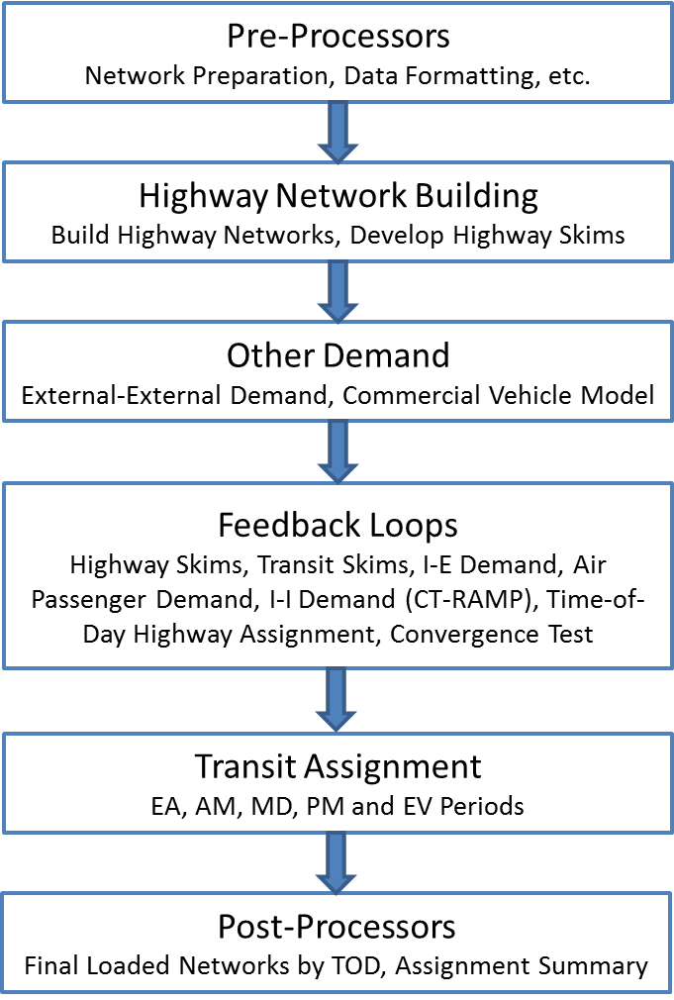
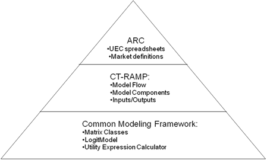
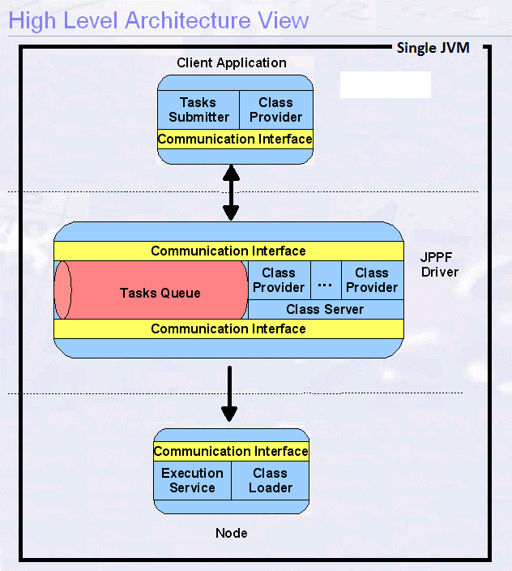

The Atlanta Regional Commission (ARC) Activity-Based Model (ABM) has been developed to ensure that the regional transportation planning process can rely on forecasting tools that will be adequate for new socioeconomic environments and emerging planning challenges.  It is also equally suitable for conventional highway projects, transit projects, and various policy studies such as highway pricing and HOV analysis.  

The ARC model is based on the CT-RAMP (Coordinated Travel Regional Activity-Based Modeling Platform) family of Activity-Based Models.  This model system is an advanced, but operational, AB model that fits the needs and planning processes of ARC.

The ARC ABM is implemented in Cube and Java and runs on a Windows 64-bit machine.  Figure 1-1 illustrates the overall model structure. The purpose of this User Guide is to describe the modeling system setup, how to setup and run the model, the model inputs and the model outputs.  Refer to the Activity-Based Model Specification Report and the Activity-Based Model Calibration Report for details about model structure, model coefficients, etc.

# Section 1.1 Hardware and Software Prerequisites

The machine used to run the ARC ABM needs to be set up with the following software and hardware configurations:

1)	Equipped with at least 128 GB of RAM and running 64-bit Windows OS.
2)	Installed with 64-bit Java Development Kit 1.8 or later.
3)	Installed with Cube Voyager 6.4 or later, with at least one installation with at least one seat Cube Cluster license. 
4)	Installed with VoyagerFileAPIInstaller.msi, which places 64-bit Voyager matrix access API files under the Citilabs/VoyagerFileAPI directory. 
5)	Include C:/Program Files/Citilabs/VoyagerFileAPI in the system %PATH%.
6)	Installed with Microsoft Visual C++ 2012 (x64) redistributable package (downloadable from http://www.microsoft.com/en-us/download/details.aspx?id=30679).

The ABM requires a 64-bit OS in order to take advantage of larger (64-bit) memory addresses.  Additional 64-bit API files provided by Citilabs are required on the machines to natively read binary Cube matrices because Cube is currently a 32-bit application.  Additional library files are also shipped with the CT-RAMP package for the same reason.

As shown in Figure 1-2, the CT-RAMP software for the microsimulation components of the model, which has been co-developed for Metropolitan Transportation Commission for San Francisco Bay Area, relies on the Common Modeling Framework (CMF), a collection of Java libraries specifically designed for the implementation of disaggregate travel demand models.  The ARC ABM utilizes the CT-RAMP Java package, which contains model logic, choice model structure, and model flow, while utility equations and model inputs and outputs specific to ARC are contained in Utility Expression Calculator (UEC) files.  These spreadsheet-based files open up the models so that the parameters, input filenames, etc. can be easily accessed, which helps prevent errors and makes the model equations more accessible.  The CT-RAMP Java package is included in the ARC ABM setup.

# Section 1.2 Distributed Setup

The starting point for the ARC ABM was the ARC trip-based model.  The trip-based model's internal-internal demand model was replaced by CT-RAMP, while the other components were used as is or updated as needed.  The other components include network processing, a commercial vehicle model, an air passenger model, an external model, a time-of-day model, transit network building, and highway and transit assignment and skimming. All of these models were threaded with Cube Cluster's DistributeINTRAStep and DistributeMULTIStep commands in order to improve runtimes.

The first type of threading/distribution threaded all calculations in an origin zone loop using Cube Cluster's DistributeINTRAStep command, which distributes the calculations in blocks of origin zones to waiting Cube Cluster processes.  When Cube Cluster completes, it writes an end text file and the main Cube process reads this file and continues to the next step.  This type of threading is independent of the number of processes available and is flexible for adding/removing processes.  Distribution by origin zone loop is allowed for threading highway assignments and matrix processing.

The second type of threading/distribution was performed using Cube Cluster's DistributeMULTIStep command, which essentially distributes code blocks across multiple processes and then waits for all of them to complete before continuing.  Unlike the first type of threading/distribution, this type requires explicitly assigning the tasks to specific processes, thereby being less flexible to adding/removing processes.  This was implemented for highway assignments by time-of-day, conversion of trip lists to time-of-day matrices, and transit assignments by access mode, local/premium, and time-of-day.  

CT-RAMP, the activity-based microsimulation component of the model, is implemented in Java, it uses the Java Parallel Processing Framework (JPPF), a robust open source library, to manage the distribution of tasks.  As illustrated in Figure 1-3, the JPPF framework consists of three main parts: a driver, a node, and a client.  The client is in this case CT-RAMP.  The nodes are also additional separate processes, typically one per computer.   The driver is a separate server process that is run on one of the cluster machines.  The driver is a facilitator that receives tasks from the client application, sends them to node processes, receives results from nodes, and returns those back to the client. The current implementation of the ARC model is configured to be run in a single node in a single machine, the same machine where the client (CT-RAMP) is running.

Node processes receive tasks of calculations, perform those calculations, and return results.  Nodes are configured through a properties file to communicate with the driver process upon their start-up.  The property file that controls the settings are the files **jppf-gui.properties** and **jppf-clientLocal.properties** in the config folder. A typical configuration might be to set the threads equal to 45 (for a 45 core machine). In these property files the property *jppf.local.execution.threads* controls the number of threads used in CT-RAMP. The majority of parallel computations in the CT-RAMP implementation occurs through tasks executed in parallel.

The driver process uses logic contained in the JPPF framework to balance computational loads across Java Virtual Machines.  The driver receives tasks from the client application and submits them in bundles to the node.  The driver also retrieves class files from the client application and passes those to the node, as needed by the node.  

The client application, which is called by the main Cube model script and configured through a properties file dynamically written by the model GUI, communicates with the driver as described above.  The client application is responsible for creating task objects that can be run in parallel and submitting those to the driver.  The driver assembles the tasks into bundles and submits them to the node.  As the node complete the tasks, the driver receives their results and submits new bundles, while balancing the submission of bundles to keep the node uniformly busy.

In addition to the JPPF components, CT-RAMP has a Household Manager that manages the household and person synthetic population in memory and provides the JPPF nodes with all household and person related data.  These Java processes have substantial memory footprints. The memory used by the processes are set in two different places. The memory available to the Household Manager is set in the file **StartHHMgrForNonDist.cmd** in the config folder. The default of 20 GB is specified using the key word *-Xmx20g -Xmx20g*. The memory available to the node is specified in the main Cube script using the key word *-Dname=main -Xmx400g*. If the computer doesn't have 400 GB of RAM, this number can be decreased.

