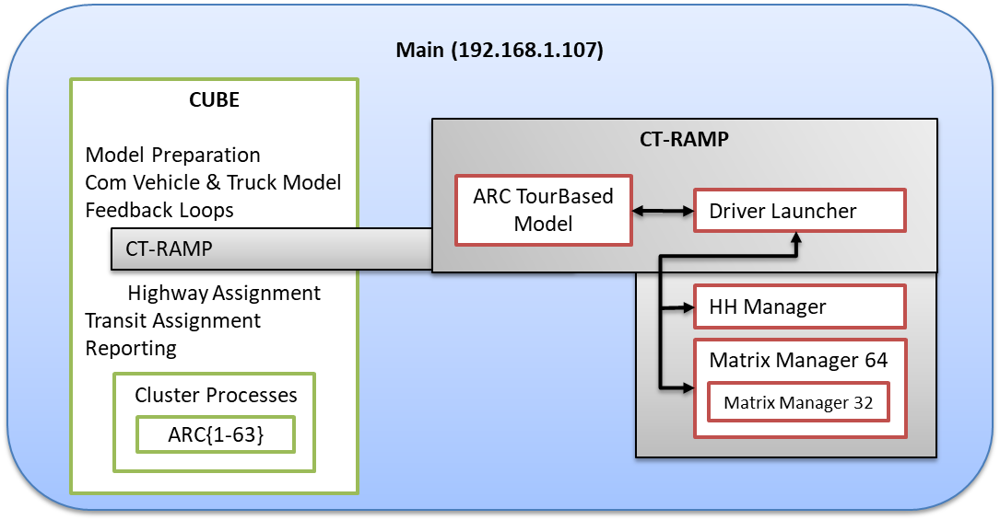

The ABM system is implemented with Java and Cube, with JPPF and Cube Cluster.  As depicted in Figure 2-1, the ARC system design consists of a main computer which:    
1)	runs the main Cube work, including some of the Cube Cluster processes    
2)	runs the main CT-RAMP (ArcTourBasedModel) Java process    
3)	runs the Household Manager Java process    
4)	runs the JPPF Driver Launcher processes which is called by ArcTourBasedModel, and which manages communicating with the nodes    
5)	optionally runs a JPPF node process which listens for tasks from the JPPF driver    

The current setup involves using ARC's ModCalc7 server as the main computer. Currently, the Cube Cluster processes and JPPF nodes are allocated on this computer as following:

* Cube cluster processes = ARC{1-63}
* Number of threads for CT-RAMP = 60

