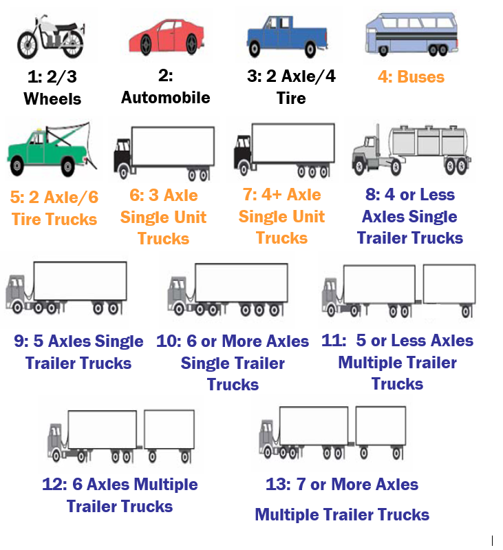
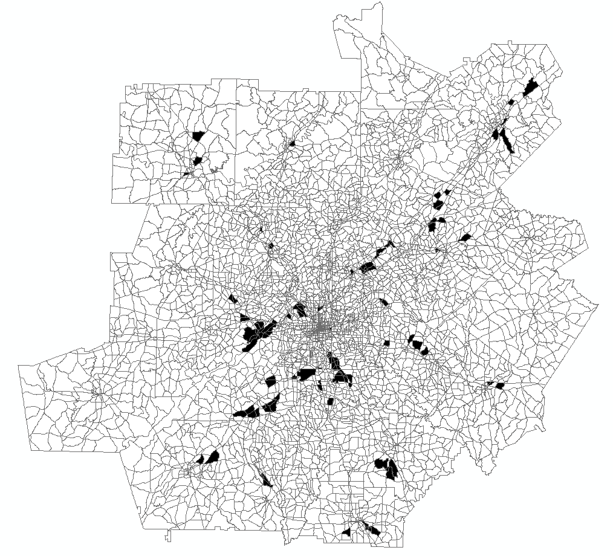
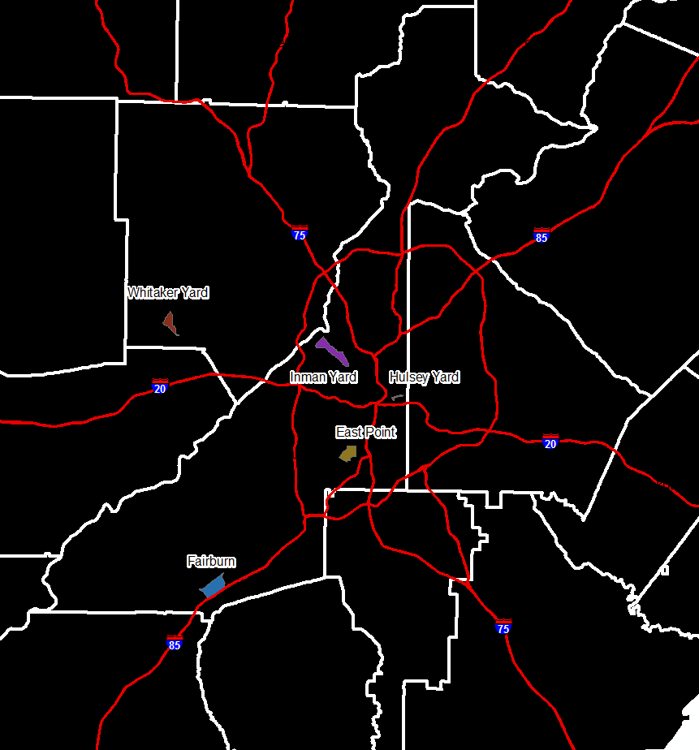

The ARC model includes a component that forecasts the number of truck trips throughout the Atlanta region.  This model includes three primary truck types:

*	Medium trucks
*	Heavy trucks
*	Commercial vehicles

The designation between medium and heavy trucks follows the Federal Highway Administration's (FHWA) F-13 classification theme as shown in Figure 6-1.  Medium trucks are defined as buses, vehicles with two axles and six tires, and single-unit vehicles with three or four axles (categories F4-F7).  Heavy trucks are defined as vehicles with either a single or multiple trailer combination (F8-F13).  Commercial vehicles are defined as non-personal, business-oriented trips that do not involve medium and heavy trucks.  Some examples of these types of trips include package delivery services, postal vehicles, taxis, police, fire, and rescue vehicles.  

The model was originally developed in the year 2007 but updates were made to the medium and heavy trucks in 2017.  These updates were primarily made by adjusting model parameters to better match vehicle classification counts that were not available during the original model development.  As special counts are required to collect the number of commercial vehicles, the model form for the commercial vehicles remains unchanged from the original development. 




# Section 6.1 Truck Trip Generation

The trip generation component of the truck model estimates the number of truck trip ends for the internal zones while the external model estimates the truck trip ends at the external stations.  The following sub-sections detailed the process for the generation of these trip ends.

# Section 6.1.1 Socioeconomic Terms
One component of the truck model trip generation includes applying coefficients to zone-level socioeconomic (SE) data.  These coefficients are multiplied by specific SE data categories to generate trips.  The commercial vehicle trip generation uses the coefficients shown in Table 6-1 with the following definitions:

*	INDEMP = construction + manufacturing + TCU + wholesale employment
*	RETEMP = retail employment
*	OFFEMP = F.I.R.E + government + service employment
*	HSHLD = number of households

Table 6-1 Commercial Vehicle Trip Generation Coefficients
```{r,echo=F,,out.height=700,message=F,warning=F,output=F}
library(kableExtra)
library(tidyverse)
library(knitr)
library(DT)
trkData1 <- read_csv('data/ComVehCoef.csv')
```
```{r,echo=F,message=F,out.height=700}
kable(trkData1) %>%
  kable_styling("striped",row_label_position = 'r')
```

The medium and heavy truck trip generation uses the coefficients shown in Table 6-2 with the following definitions:

*	AMCEMP = agriculture, mining, and construction
*	MTWEMP = utilities, manufacturing, wholesale, transportation and warehousing employment
*	RETEMP = retail employment
*	OTHEMP = all remaining employment
*	HSHLD = number of households

Table 6-2 Medium and Heavy Truck Trip Generation Coefficients
```{r,echo=F,,out.height=700,message=F,warning=F,output=F}
trkData2 <- read_csv('data/TrkVehCoef.csv')
```
```{r,echo=F,message=F,out.height=700}
kable(trkData2) %>%
  kable_styling("striped",row_label_position = 'r')
```

# Section 6.1.2 Area Type Adjustments
Truck trip characteristics can differ significantly between dense urban environments and sparsely population rural areas.  To account for this effect, the model includes area type adjustments which are applied in the generation formulas in addition to the previously mentioned coefficients.  The area type adjustments for commercial vehicle (COM), medium truck (MTK) and heavy truck (HTK) are provided in Table 6.3.  The general application of the area type adjustments would result in lower truck trip rates as an area transitions from rural to urban areas. 

Table 6-3 Medium and Heavy Truck Area Type Adjustments
```{r,echo=F,,out.height=700,message=F,warning=F,output=F}
trkData3 <- read_csv('data/TrkAreaType.csv')
```
```{r,echo=F,message=F,out.height=700}
kable(trkData3) %>%
  kable_styling("striped",row_label_position = 'r')
```


When comparing the model against observed truck counts, summaries were prepared which include tabulations of truck counts inside and outside I-285 which forms a perimeter around the more urbanized Atlanta area.  In addition to the area type adjustments, another factor was introduced in the model to further factor trips inside I-285 as the model tended to over forecast volumes.  This was done by incorporating a check on the zone location and applying the following adjustment factors:

*	Medium trucks inside I-285 = 0.70
*	Heavy trucks inside I-285 = 0.50

# Section 6.1.3 Truck Zones

There are certain cases where the employment within a zone may not accurately reflect the amount of truck activity.  One example is a major distribution center.  To model these effects, truck zones were created based on a review of aerial photography and known distribution centers.  For these flagged zones, the model applies a factor for medium trucks and heavy trucks of 1.5 and 2.0, respectively.  A map of the truck zones is provided in Figure 6-2.



# Section 6.1.4 Intermodal Yards

There are five intermodal yards in the Atlanta region including Hulsey Yard, Fairburn Yard, Whitaker Yard, Inman Yard, and Industry Yard / East Point as shown in Figure 6-3.  Upon inspecting the updated model results, it was observed the model was generally underestimating truck trips around these intermodal facilities.  This is expected given that the level of employment in those TAZs representing the intermodal yards is not indicative of the amount of truck trips generated from these yards, even after applying the truck zone factors.  ARC's Freight Plan included a table with the annual lifts for each location except Industry Yard / East Point.  Using GDOT vehicle classification counts near these facilities, truck trip rates were computed by associating truck volumes with the annual lifts.  The annual lifts, nearby truck volumes, and computed rates are provided in Tables 6-4, 6-5, and 6-6.  After calculating the rates, it was observed that Hulsey, Fairburn, and Whitaker generated similar rates while Inman was lower.  For the model application, the rates for Hulsey, Fairburn, and Whitaker were averaged and the rates from Inman Yard were used to impute the annual lifts at Industry Yard / East Point.

<br/>



<br/>

Table 6-4 Intermodal Yard Annual Lifts
```{r,echo=F,,out.height=700,message=F,warning=F,output=F}
trkData4 <- read_csv('data/IntermodalAnnLifts.csv')
```

```{r,echo=F,message=F,out.height=700}
kable(trkData4, format.args = list(big.mark = ",")) %>%
  kable_styling("striped",row_label_position = 'r')
```

<br/>

Table 6-5 Truck Volumes Near Intermodal Yards
```{r,echo=F,,out.height=700,message=F,warning=F,output=F}
trkData5 <- read_csv('data/IntermodalTrkVolumes.csv')
```
```{r,echo=F,message=F,out.height=700}
kable(trkData5, format.args = list(big.mark = ",")) %>%
  kable_styling("striped",row_label_position = 'r')
```

<br/>

Table 6-6 Intermodal Yard Truck Trip Rates
```{r,echo=F,,out.height=700,message=F,warning=F,output=F}
trkData6 <- read_csv('data/IntermodalRates.csv')
```
```{r,echo=F,message=F,out.height=700}
kable(trkData6) %>%
  kable_styling("striped",row_label_position = 'r')
```


# Section 6.1.5 External Truck Model

The external model estimates the total truck trips at the external stations; however, the truck model trip generation component estimates total trip ends, both internal to the region and for trucks with either an origin or destination outside the region.  The external share of the total trip ends is modeled as a function of the internal zone's distance to the external stations using the highway network.  Zones that are closer to the edge of the modeled region will generally have a higher share of external trips than zones farther away.  The external share model is applied as follows and depicted graphically in Figure 6-4.

ExtPct = $ExtDist^{-1.2}$

where, ExtDist = distance between external station and internal zone

Percent Commercial = max(min(1.54 * ExtPct,0.9),0)

Percent Medium = max(min(4.94 * ExtPct,0.9),0)

Percent Heavy = max(min(8.25 * ExtPct,0.9),0)

The maximum allowed external share is 90% and the equation is structured so that the minimum share cannot be less than zero.  

<br/>


# Section 6.2 Truck Trip Distribution

The ARC truck model uses a Gravity model for trip distribution.  The original ARC truck survey suggested that average trip lengths for medium trucks was 19.9 miles and heavy trucks was 22.8 miles.  The heavy truck distance appeared low compared to the medium trucks and given that the survey was completed when the model region was only 13 counties, the targeted heavy truck length was assumed to be around 25 to 26 miles.  These were the targets used for to calibrate the models for medium and heavy trucks.  No survey exists for commercial vehicles; therefore, the targets were asserted based on the medium and heavy truck targets.  

These targets were used to calibrate a set of friction factors for internal and external truck trips.  For internal trips, a negative exponential function was applied as follows:

 F = a * ($e^{(b * t)}$)

where,
 t = travel time in minutes
 
 a, b = calibrated coefficients
 
 
For the external trips, a power function was used as the negative exponential function did not produce reasonable results.  The power function is as follows: 

 F = a * ($t^{-b}$)
 
where,
 t = travel time in minutes
 
 a, b = calibrated coefficients
 
The parameters for the truck model friction factors are provided in Table 6-7 and the average travel distances and average free-flow travel times are provided in Table 6-8.  A graphical representation of the friction factors is provided in Figure 6-5.

Table 6-7 Truck Model Friction Factor Parameters
```{r,echo=F,,out.height=700,message=F,warning=F,output=F}
trkData7 <- read_csv('data/TruckFrictionFactors.csv')
```
```{r,echo=F,message=F,out.height=700}
kable(trkData7, format.args = list(big.mark = ",")) %>%
  kable_styling("striped",row_label_position = 'r')
```

<br/>

Table 6-8 Truck Model Average Travel Distance and Time
```{r,echo=F,,out.height=700,message=F,warning=F,output=F}
trkData8 <- read_csv('data/TruckAvgDistTime.csv')
```
```{r,echo=F,message=F,out.height=700}
kable(trkData8) %>%
  kable_styling("striped",row_label_position = 'r')
```

<br/>


 
# Section 6.3 Truck Time of Day Factors

As the ARC model highway assignment uses time periods, it was necessary to split the truck trips by time of day.  Some of the vehicle classification counts collected by GDOT include hourly volumes for medium and heavy trucks.  These classification counts were tabulated by hour of the day as shown in Figure 6-6 and then aggregated to the appropriate time periods to compute percentages.  As hourly counts for the commercial vehicles were not available, the percentages were asserted.  The time of day truck percentages are shown in Table 6-9.

<br/>


<br/>

Table 6-9 Truck Model Time of Day Percentages
```{r,echo=F,,out.height=700,message=F,warning=F,output=F}
trkData9 <- read_csv('data/TruckTOD.csv')
```
```{r,echo=F,message=F,out.height=700}
kable(trkData9) %>%
  kable_styling("striped",row_label_position = 'r')
```


